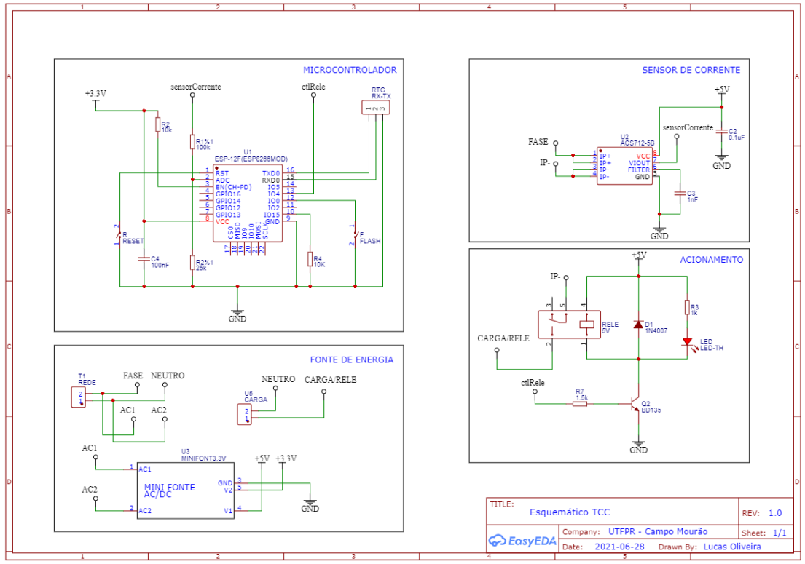
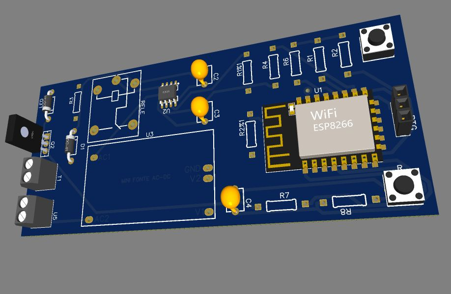
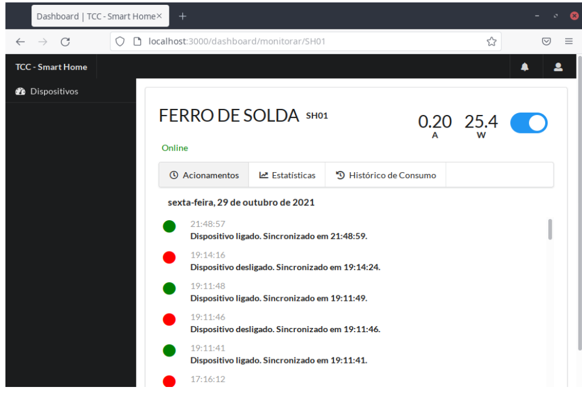

# Sistema IoT: Microcontrolador
Código-fonte do microcontrolador ESP8266 para utilização juntamente com o SIstema IOT de acionamento e monitoramento de carga de baixa potência.

## Sobre

Este repositório faz parte do projeto desenvolvido para o trabalho de conclusão de curso de bacharel em Engenharia Eletrônica pela Universidade Tecnológica Federal do Paraná. Neste repositório está presente o código fonte do software presente no hardware desenvolvido neste projeto. O software possui as seguintes características:

* Software para hardware de monitoramento de corrente elétrica e acionamento de carga via relé, utilizando como controlador o micro ESP8266;
* Código-fonte para o microcontrolador ESP8266, podendo, também, ser reutilizado em plataformas NodeMCU e Amica mediante adaptações;
* Comunicação com Plataforma Web via protocolo MQTT e HTTP;
* Biblioteca "Wifi Manager" que realiza a configuração inicial da Wifi do hardware;
* Biblioteca "Filters" para obtenção filtragem das coletas do sensor de corrente ACS712;

## Hardware

O hardware foi projetado tendo em vista o padrão modular de projetos eletrônicos, como pode ser observado na figura abaixo, sendo quatro blocos: microcontrolador; sensor de corrente; fonte de energia e acionamento.

Com o auxílio do software web EasyEDA, é possível obter a PCB para manufatura da placa do projeto. Um esboço 3D pode ser observado a seguir.

## Instalação

Para compilar o software no hardware é muito simples: comece copiando as bibliotecas da pasta "Libraries" deste repositório para a pasta "C:\Users\SEU_USUARIO\Documents\Arduino\libraries" do seu computador.

Há três parâmetros essenciais na configuração do software do hardware, sendo eles:

- "uidDispositivo", onde você deve colocar o nome de identificação do seu dispositivo, sendo o mesmo do banco de dados;
- "servidor_mqtt", onde você deve colocar o endereço IP ou URL da máquina que está rodando o painel de controle web;
- "calibracao", constante de calibração para obtenção através do sensor ACS712 do valor correto de corrente elétrica, que deve ser calculada conforme explicada neste [trabalho](https://1drv.ms/b/s!AtUhTt_AN0eRh4B7avzjPnZivLJ01Q?e=E67Xtg).

Depois de copiar as bibliotecas e alterar as variáveis e constantes acima, abra o arquivo "sistemaMonitoramento.ino" no software Arduino IDE e inicie a compilação com o hardware conectado em seu computador, seguindo o passo-a-passo disponibilizado neste [trabalho](https://1drv.ms/b/s!AtUhTt_AN0eRh4B7avzjPnZivLJ01Q?e=E67Xtg).

Por fim, se a compilação do softweare no hardware ocorrer conforme o projetado e, também, estiver rodando [o painel de controle web](https://github.com/lucsoliveira/Servidor-Aplicacao-Web-Sistema-IoT) em um servidor externo, com o hardware conectado ao painel de controle, é possível acessar uma Dashboard que possui todos os componentes necessários para o controle e o monitoramento, conforme a imagem a seguir.

## 

<!-- BUILT WITH -->

### Feito com

* ESP8266
* Sensor ACS712
* Relé
* Arduino IDE
* Biblioteca Filters
* Biblioteca Wifi Manager
* Protocolo MQTT

<!-- LICENSE -->

## Licença

Distribuído sob a MIT License.

<!-- CONTACT -->

## Contato

Lucas de Oliveira | [LinkedIn](https://www.linkedin.com/in/engenheiro-lucas-oliveira/) 

<!-- MARKDOWN LINKS & IMAGES -->
<!-- https://www.markdownguide.org/basic-syntax/#reference-style-links -->

[contributors-url]: https://github.com/lucsoliveira/NotificaB3/graphs/contributors

[forks-url]: https://github.com/lucsoliveira/NotificaB3/network/members

[stars-url]: https://github.com/lucsoliveira/NotificaB3/stargazers

[issues-url]: https://github.com/lucsoliveira/NotificaB3/issues

[linkedin-url]: https://github.com/lucsoliveira/NotificaB3

[dashboard-screenshot]: ./ReadMe/dashboard.gif
